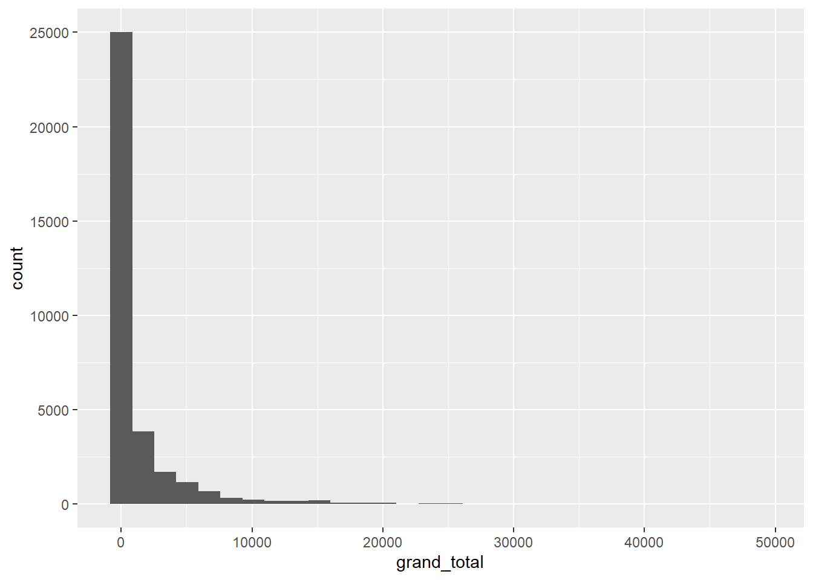

ggplot2: Scale x log
================

``` r
fishing <- readr::read_csv('https://raw.githubusercontent.com/rfordatascience/tidytuesday/master/data/2021/2021-06-08/fishing.csv')

fishing %>% 
  summarise(max_gt = max(grand_total,
                 na.rm = TRUE),
            min_gt = min(grand_total,
                 na.rm = TRUE))
#> # A tibble: 1 x 2
#>   max_gt min_gt
#>    <dbl>  <dbl>
#> 1  48821      0

fishing %>% 
  count(grand_total, sort = TRUE)
#> # A tibble: 2,380 x 2
#>    grand_total     n
#>          <dbl> <int>
#>  1          NA 31767
#>  2           0  3075
#>  3           1  1387
#>  4           2   884
#>  5           3   672
#>  6           4   440
#>  7           5   415
#>  8           9   307
#>  9          10   284
#> 10          11   274
#> # ... with 2,370 more rows


fishing %>% 
  count(grand_total)
#> # A tibble: 2,380 x 2
#>    grand_total     n
#>          <dbl> <int>
#>  1      0       3075
#>  2      0.0664     5
#>  3      0.0885     5
#>  4      0.0893     5
#>  5      0.194      5
#>  6      0.222      5
#>  7      0.3        5
#>  8      0.378      5
#>  9      0.420      5
#> 10      0.495      5
#> # ... with 2,370 more rows

# quite skewed because of many 0's and
# large values in the grand_total
fishing %>% 
  ggplot(aes(grand_total)) +
  geom_histogram()
```



As we see there is much data all around `0`. To see it a bit clearer we
can use a log transform on the x-axis data.

<span
style="color: #5196b4;background-color:#f4e4e7">`scale_x_log10()`</span>
puts the x-axis on a log scale.

Note: There is also similarly a <span
style="color: #5196b4;background-color:#f4e4e7">`scale_y_log10()`</span>.

<pre class='sourceCode r'><code># scale the x axis to using log values<br># to see the distribution better<br># we see many 0's and then a few other numbers<br>fishing %>% <br>&nbsp;&nbsp;ggplot(aes(grand_total + 1)) +<br>&nbsp;&nbsp;geom_histogram() +<br>&nbsp;&nbsp;<span style='background-color:#f4e4e7;color:#5196b4'>scale_x_log10()</span></code></pre>


We can also set the <span
style="color: #5196b4;background-color:#f4e4e7">breaks</span> ourselves.

<pre class='sourceCode r'><code># scale the x axis to using log values<br># to see the distribution better<br># also set the breaks<br>fishing %>% <br>&nbsp;&nbsp;ggplot(aes(grand_total + 1)) +<br>&nbsp;&nbsp;geom_histogram() +<br>&nbsp;&nbsp;scale_x_log10(<span style='background-color:#f4e4e7;color:#5196b4'>breaks = c(0, 10, 100, 1000, 10000, 20000, 50000)</span>)</code></pre>


## Example 2

Here’s another example taken from Rebecca Barter’s [blog post on
ggplot2](https://www.rebeccabarter.com/blog/2017-11-17-ggplot2_tutorial/).

``` r
gapminder <- read.csv("https://raw.githubusercontent.com/swcarpentry/r-novice-gapminder/gh-pages/_episodes_rmd/data/gapminder-FiveYearData.csv")

gapminder_2007 <- gapminder %>% filter(year == 2007)

ggplot(gapminder_2007, aes(x = gdpPercap, y = lifeExp, color = continent, size = pop)) +
  geom_point(alpha = 0.5)
```


Again interesting data is near 0 and hard to see. Let’s scale the x axis
again. This time we use <span
style="color: #5196b4;background-color:#f4e4e7">`label = comma`</span>
to make our axis labels have a <span
style="color: #5196b4;background-color:#f4e4e7">`,`</span>: `1,000`,
`2,000`, `3,000` etc.

<pre class='sourceCode r'><code>ggplot(gapminder_2007, aes(x = gdpPercap, y = lifeExp, color = continent, size = pop)) +<br>&nbsp;&nbsp;geom_point(alpha = 0.5) +<br>&nbsp;&nbsp;scale_x_log10(<span style='background-color:#f4e4e7;color:#5196b4'>label = comma</span>)</code></pre>


